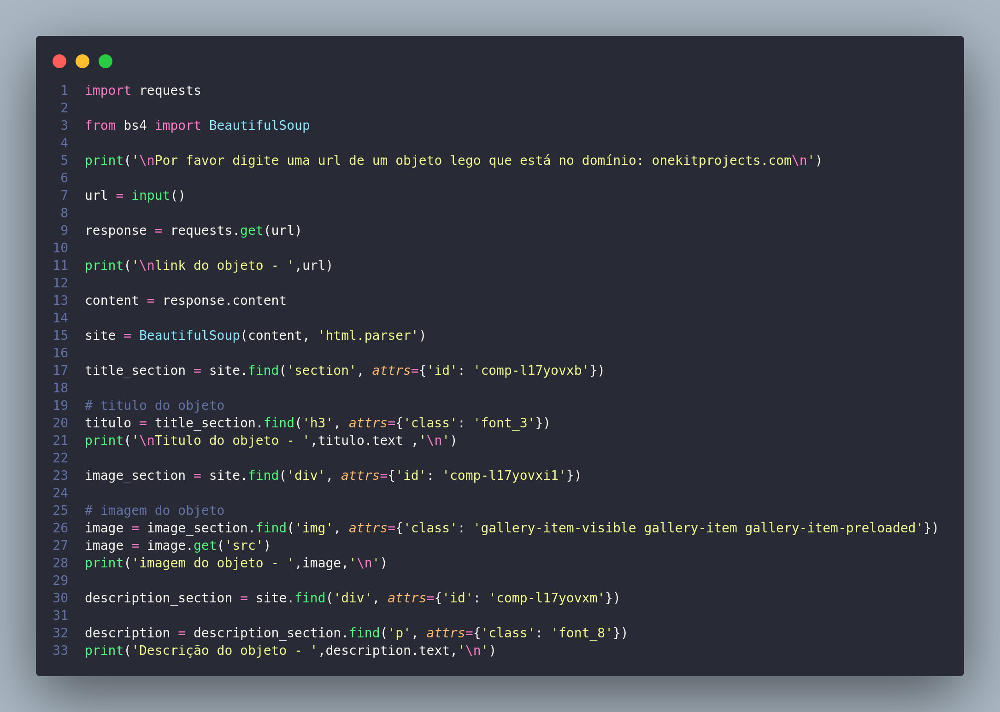

# scraping-lego

web scraping de objetos educacionais do site https://www.onekitprojects.com que é ligado ao https://nxtprograms.com/

execute e cole um link do código de um objeto do site onekitprojects.com

o programa deverá lhe informar as informações de nome , foto, descrição e link do tutorial de montagem em pdf do objeto

</img>

# Documentação

</img>

importando as libs *requests* (necessária para fazer requesições http de páginas) e *BeautifulSoup* (necessária para fazer o web scraping dos dados)

o input para que o usuário cole o link do objeto para a extração de dados

a váriavel response recebe o resultado da requisição get da página escolhida

a váriavel site recebe o contéudo da página transformado em um objeto BeautifulSoup

***Titulo***

a váriavel title_section recebe a sessão em que se encontra o título do objeto

a váriavel titulo recebe o texto da tag que contém o titulo dentro do escopo da title_section

***Imagem***

a váriavel image_section recebe a div em que se encontra a imagem do objeto

a váriavel image recebe o conteúdo do *atributo src* da tag img da imagem do objeto dentro do escopo da image_section

***Descrição***

a váriavel description_section recebe a div em que se encontra a descrição do objeto

a váriavel description recebe o parágrafo da descrição do objeto dentro do escopo da description_section
