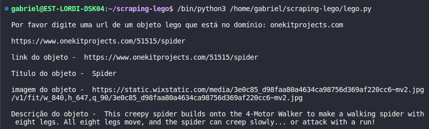

# scraping-lego
web scraping de objetos educacionais do site https://www.onekitprojects.com que é ligado ao https://nxtprograms.com/

execute e cole um link do código de um objeto do site onekitprojects.com

o programa deverá lhe informar as informações de nome , foto, descrição e link do tutorial de montagem em pdf do objeto

</img>